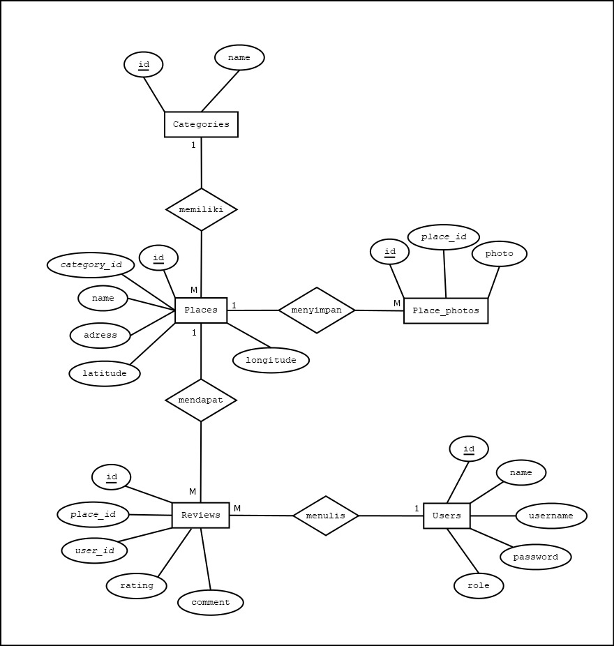

# 🍔 Aplikasi Review Kuliner (CodeIgniter 4)

Proyek ini adalah aplikasi berbasis web yang berfungsi sebagai platform untuk mencari rekomendasi tempat makan, memberikan ulasan (review), menyimpan tempat favorit, hingga melakukan transaksi pembelian voucher kuliner.

Proyek ini secara utuh mengimplementasikan arsitektur MVC (Model-View-Controller) dengan *framework* CodeIgniter 4 sebagai pemenuhan **Spesifikasi Project Pemrograman Web Lanjut di Universitas Dian Nuswantoro**.

## ✨ Fitur Utama Aplikasi

* **Autentikasi:** Sistem Login & Register yang aman untuk *User* dan *Admin*.
* **Manajemen Tempat Kuliner:** Menampilkan daftar tempat makan lengkap dengan foto, kategori, dan *tag*.
* **Sistem Review & Ulasan:** Pengguna dapat memberikan ulasan langsung pada tempat kuliner.
* **Fitur Favorit:** Pengguna dapat menyimpan *bookmark* tempat kuliner favorit mereka ke dalam akun.
* **Voucher & Pembayaran (DOKU):** Integrasi *Payment Gateway* DOKU untuk *checkout* pembelian voucher secara otomatis.
* **RESTful API:** Menyediakan *endpoint* API khusus untuk akses data tempat kuliner.

## 📊 Entity Relationship Diagram (ERD)



## 🛠️ Persyaratan Sistem

Pastikan komputer Anda sudah terinstal perangkat lunak berikut:

* PHP ^7.4 atau ^8.0
* Composer
* MySQL / MariaDB (XAMPP/MAMP/Laragon)
* Git

## 🚀 Cara Instalasi & Menjalankan Aplikasi

### 1. Clone Repository

Buka terminal/command prompt, lalu jalankan perintah berikut:

```bash
git clone https://github.com/iqbalulul19/project-reviewkuliner-ci4.git
cd project-reviewkuliner-ci4
```

### 2. Install Dependencies

```bash
composer install
```

### 3. Konfigurasi Environment

Rubah file `.env.example`  menjadi `.env`:

```bash
cp .env.example .env
```

Buka file `.env` di teks editor, hapus tanda `#` pada `CI_ENVIRONMENT` lalu ubah menjadi:

```
CI_ENVIRONMENT = development
```

### 4. Setup Database

Buat database terlebih dahulu, sesuaikan konfigurasi koneksi database di file `.env`, lalu jalankan:

```bash
php spark migrate
php spark db:seed DatabaseSeeder
```

### 5. Jalankan Aplikasi

```bash
php spark serve
```

Aplikasi dapat diakses melalui `http://localhost:8080`.

## 👤 Akun Demo

Gunakan akun berikut untuk mencoba aplikasi setelah proses seeding database selesai:

| Role  | Username | Password |
|-------|----------|----------|
| User  | ian      | 123      |
| Admin | admin    | admin123 |
